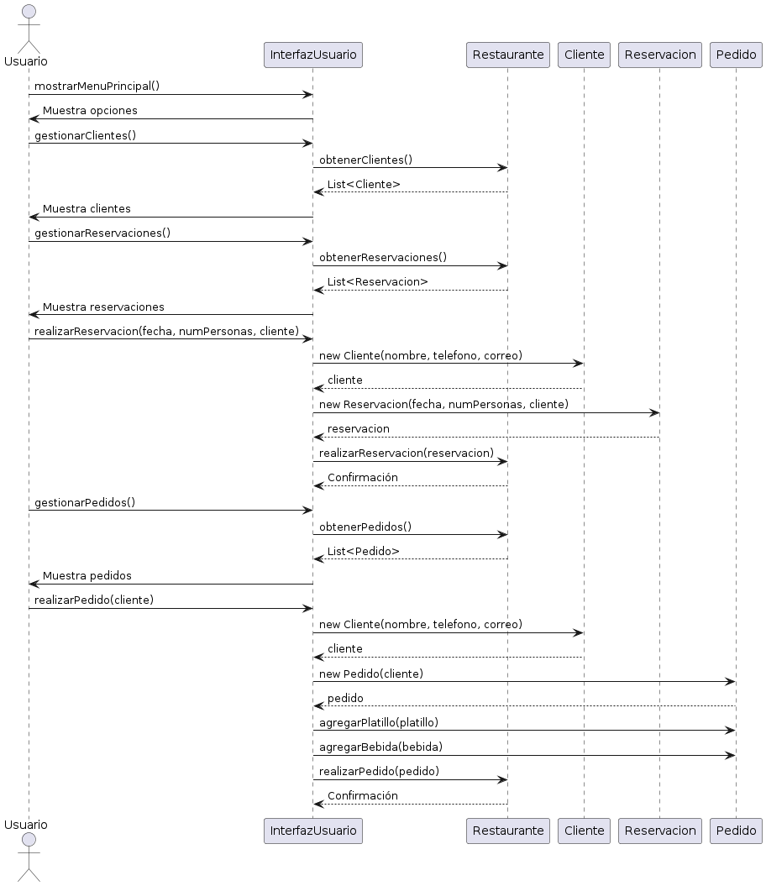
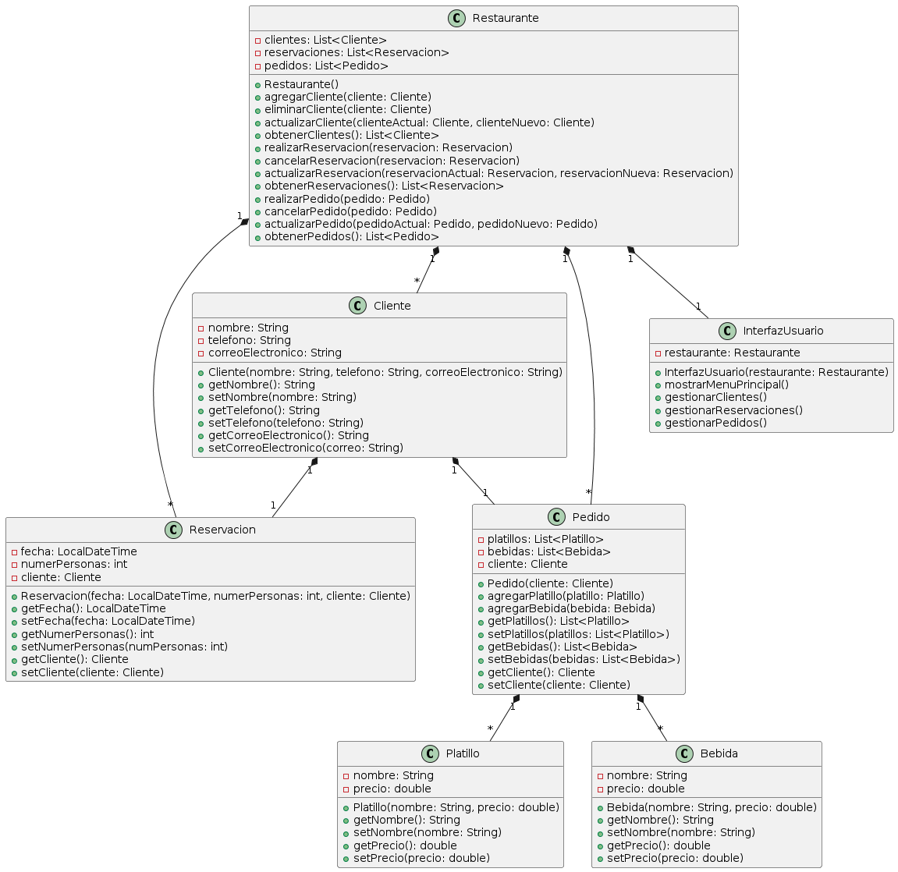
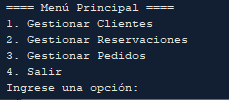
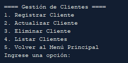
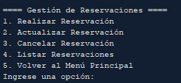
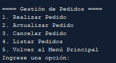

# Sistema de Gestión de Clientes para un Restaurante

Wilmer Salazar

Este proyecto tiene como objetivo desarrollar un sistema de gestión de clientes para un restaurante utilizando Java y los principios de la Programación Orientada a Objetos (POO). El sistema permite al restaurante llevar un registro de sus clientes, gestionar sus reservaciones, tomar pedidos y brindar un servicio más eficiente.

## Características principales

- Gestión de clientes: Registrar, actualizar, eliminar y listar clientes.
- Gestión de reservaciones: Realizar, actualizar, cancelar y listar reservaciones.
- Gestión de pedidos: Realizar, agregar platillos y bebidas, actualizar, cancelar y listar pedidos.
- Interfaz de usuario basada en consola para interactuar con el sistema.
- Aplicación de los principios de POO, incluyendo encapsulamiento, herencia, polimorfismo y abstracción.

## Estructura del proyecto

1. `Cliente`: Representa a un cliente del restaurante con atributos como nombre, teléfono y correo electrónico.
2. `Reservacion`: Representa una reservación realizada por un cliente con atributos como fecha, hora y número de personas.
3. `Pedido`: Representa un pedido realizado por un cliente con listas de platillos y bebidas.
4. `Platillo`: Representa un platillo del menú con nombre y precio.
5. `Bebida`: Representa una bebida del menú con nombre y precio.
6. `Restaurante`: Contiene métodos para gestionar las listas de clientes, reservaciones y pedidos.
7. `InterfazUsuario`: Contiene métodos para interactuar con el usuario a través de la consola.
8. `Main`: Clase principal que inicia la aplicación y la interfaz de usuario.

## Requisitos

- Java 8 o superior
- Un entorno de desarrollo integrado (IDE) compatible con Java

## Instrucciones de uso

1. Clona este repositorio en tu máquina local.
2. Abre el proyecto en tu IDE preferido.
3. Compila y ejecuta la clase `Main`.
4. Sigue las instrucciones en la interfaz de usuario basada en consola para interactuar con el sistema.

## Diagrama de Secuencia

## Diagrama de Clases

## Video

## MenúS

## Uso del Sistema

El sistema se ejecuta a través de la clase InterfazUsuario. Al iniciar la aplicación, se muestra el menú principal, donde el usuario puede seleccionar las opciones para gestionar clientes, reservaciones y pedidos.

Cada opción del menú principal conduce a un submenú específico, donde el usuario puede realizar las operaciones correspondientes, como registrar un nuevo cliente, realizar una reservación, tomar un pedido, etc.

El sistema utiliza la entrada del usuario a través de la consola y realiza las operaciones solicitadas interactuando con las clases Restaurante, Cliente, Bebida y otras clases relacionadas.

## Contribución

Si deseas contribuir a este proyecto, puedes seguir los siguientes pasos:

1. Haz un fork de este repositorio.
2. Crea una nueva rama para tus cambios: `git checkout -b mi-nueva-rama`.
3. Realiza tus modificaciones y commit los cambios: `git commit -am 'Agrega mis cambios'`.
4. Envía tus cambios al repositorio remoto: `git push origin mi-nueva-rama`.
5. Crea un nuevo Pull Request en este repositorio.

## Licencia

Este proyecto está licenciado bajo la [Licencia MIT](LICENSE).
